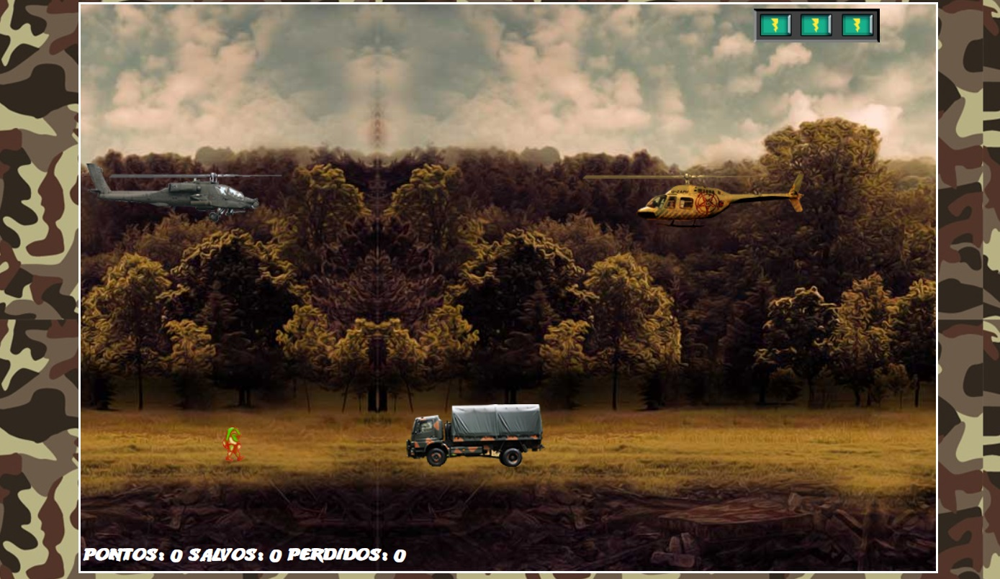

    <h1>HTML Web Developer</h1>
    <h2><i>Construindo jogo de nave utilizando HTML, CSS e JavaScript</i></h2>
    
    
     
    
 <h3>Este repositório é um projeto JavaScript Game Developer </h3>
 
 <i>HTML Web Developer</i>

    
    

